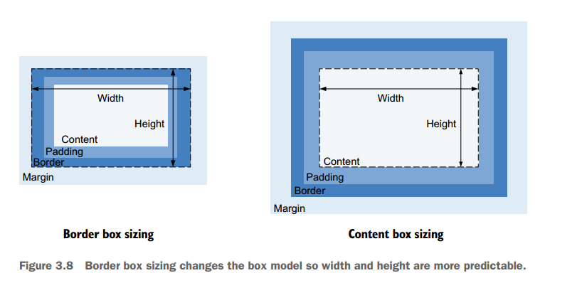
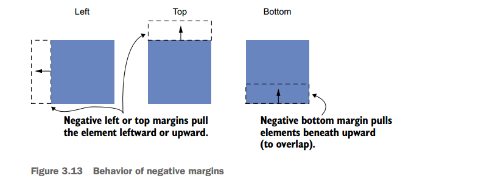

# Document flow and box model

### Normal Document flow

It refers to default layout behaviour of elements on the page. Inline elements flow along with the text of the page, from left to right, line wrapping when they reach the edge of their container. Block level elements fall on individual lines, with a line break above and below.

Normal document flow is designed to work with a constrained width and an unlimited height. Width of parent element determines the width of its children but height of children determines height of its parent. 

**Tip** :  To begin laying out a page, it is best to do so from the outside in. Get the larger container elements where you want them before moving on to the smaller ones inside them.

see *double container pattern* in example source code.

**Logical properties** 

These provide a way to work with elements in terms of their block and inline directions. We swap out the concepts of horizontal and vertical for *inline base direction* and *block flow direction*. Both classic and their equivalent logical properties can override each other.

e.g
* width/inline-size
* height/block-size
* margin-top/margin-block-start
* margin-right/margin-inline-end
* max-width /max-inline-size

### The box model

Each element on the page is made up of four overlapping rectangles. *content area*, *padding area*, *border area*, *margin area*. 
By default box-sizing is set to content box. This could create alignment issues because top and bottom margins and paddings behave a little unusually on inline elements. Either you could set display to inline-block for such. or set box-sizing to border-box.

Universal border box sizing
<code>
*,
::before,
::after {
box-sizing: border-box;
}
</code>

### Element height

The height of a container is organically determined by its content, not the container itself.  To control overflow behaviour use overflow property. 

using *min-height* and *max-height* units is better option. 

### Negative margins

### collapsed margins

In the absence of any other CSS interfering, all the adjacent top and bottom margins will collapse.  An element's margin collapsing outside its container typically produces an undesirable effect if the container has a background.

fix to prevent margins from collapsing:
* *overflow: auto* to containers prevent margins inside the container from collapsing with those outside.
* Adding a border or padding b/w two margins
* flexbox or grid elements dont have this behaviour
* eleements with *table-cell* display or even *table-row*

### spacing elements within a container

the lobotomized owl selector

<code> .stack > * + * {
margin-block-start: 1.5em;
}
</code>
add stack class to any stacking containers for spacing between items. 

