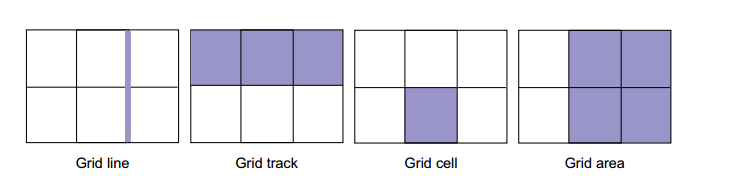

# Layout with grid

Grid is suitable for 2-dimensional layout

* like flexbox grid has gap property. But unlike flexbox, its possible to specify both vertical and horizontal gutters with it
* Your design doesn't need to fill every cell of the grid. Leave a cell empty where you want to add whitespace
* flexbox works from the content out, whereas grid works from the layout in

Anatomy of a grid

So how do you work with grids

**step 1: Set up layout**. You need to decide whether you want to define layout explicitly or let the content decide for you (implicitly)

properties:

`
	container {
		display: grid;
		grid-template-rows:
		grid-template-columns:
		grid-template-area:
	}
`

size values of track can be defined using length units like px, percentages and fractional units with the help of **repeat(auto-fill/auto-fit/N, xem/minmax()/auto)

for content based layout, we need to define how placement algorithm creates more tracks using properties like *grid-auto-rows, grid-auto-column, grid-auto-flow* and where we need dense settings of grid items or not.

**step 2: place grid items**

we can place grid items using 

`item {
grid-row: start/end;
grid-column: start/end;
or grid-area: area-name
}`

step 3: adjust grid items, alignment issues

for alignment use these properties:

align items: *justify-self, align-self*
align all items: *justify-items, align-items*
align tracks: *justify-content, align-content*

